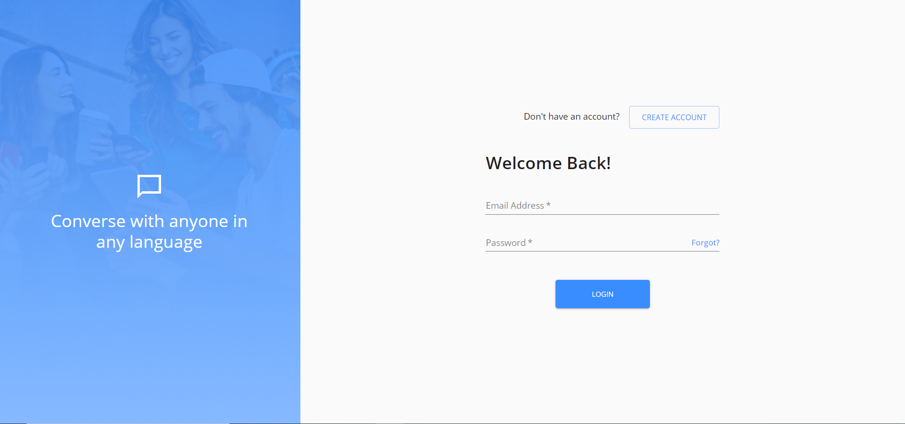
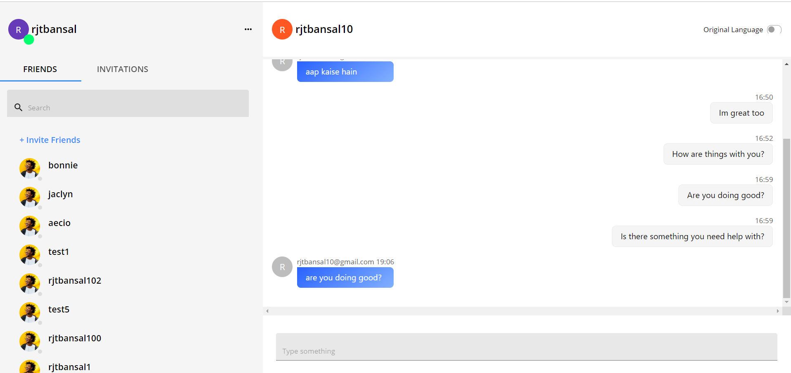
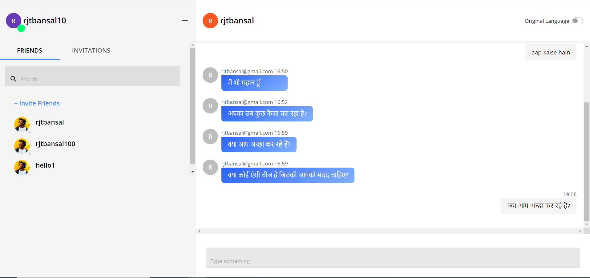
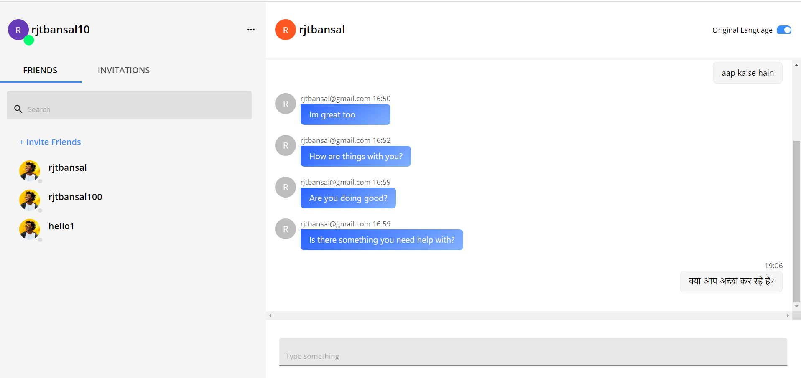
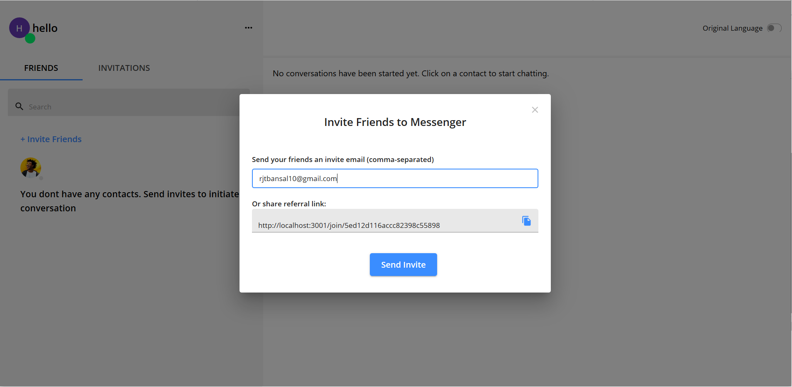
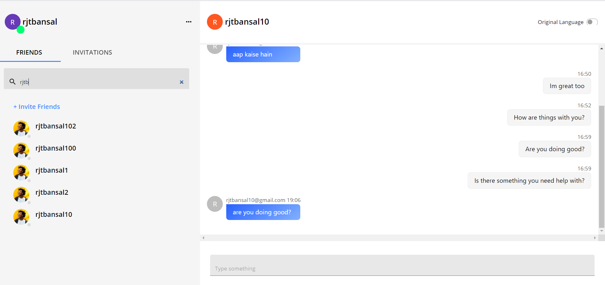
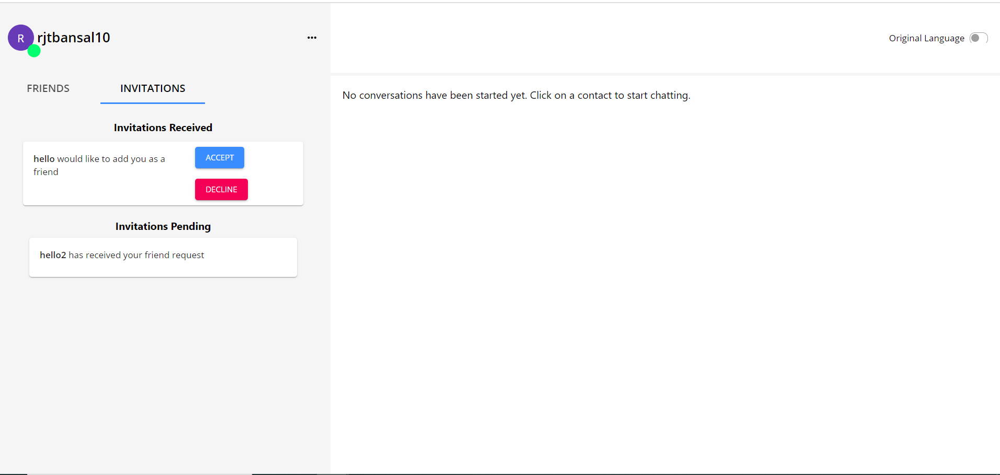

# Team Penguin : World Chat Messenger

**_Contents:_**
- [About](#about)
- [Authors](#authors)
- [Features](#features)
- [Screenshots](#screenshots)

# About

World Chat Messenger is a modern chat application that allows users to communicate in their own language. Think of a scenario when you are travelling in a foreign country and would like to have seamless communication with another individual. Maybe you need to ask for directions to a tourist spot or explore non touristy areas or eat where locals would. All you need is this messenger app, send an invite to a person you want to communicate with and as soon as they signup you can have seamless conversation.

**Technology Stack**
- *Front End*: React, Material UI
- *Back End*: Node, Express, MongoDB on the cloud, SendGrid for Emails, Google Translate API for translations

# Authors

[Rajat Bansal](https://github.com/rjtbansal) & [Carol Chung](https://github.com/cch5ng)

# Features
- End to end translation of languages
- Support for currently 5 languages: English, Hindi, French, Spanish, Mandarin
- Ability to see original language of the sender
- Invite to users via email
- Responsiveness for mobile
- Search friends

# Screenshots
## Signup

## Login

## Main Chat Page

## Conversation in translated language (hindi)

## Ability to Switch to Original Language 

## Email Invite

## Search Friends

## Invitation Tab - Sent and Received Invites

Deployment link to appear very soon.

 

