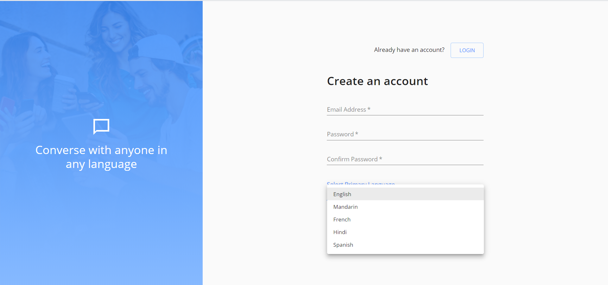

# Team Penguin : World Chat Messenger

**_Contents:_**
- [About](#about)
- [Authors](#authors)
- [Screenshots](#screenshots)

# About

World Chat Messenger is a modern chat application that allows users to communicate in their own language. Think of a scenario when you are travelling in a foreign country and would like to have seamless communication with another individual. Maybe you need to ask for directions to a tourist spot or explore non touristy areas or eat where locals would. All you need is this messenger app, send an invite to a person you want to communicate with and as soon as they signup you can have seamless conversation.

** Technology Stack **
Front End: React, Material UI
Back End: Node, Express, MongoDB on the cloud, SendGrid for Emails, Google Translate API for translations

# Authors

[Rajat Bansal](https://github.com/rjtbansal) & [Carol Chung](https://github.com/cch5ng)

# Screenshots

Deployment link to appear very soon.

 

